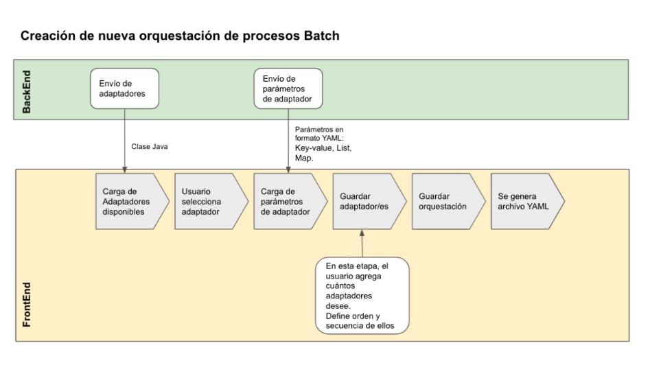
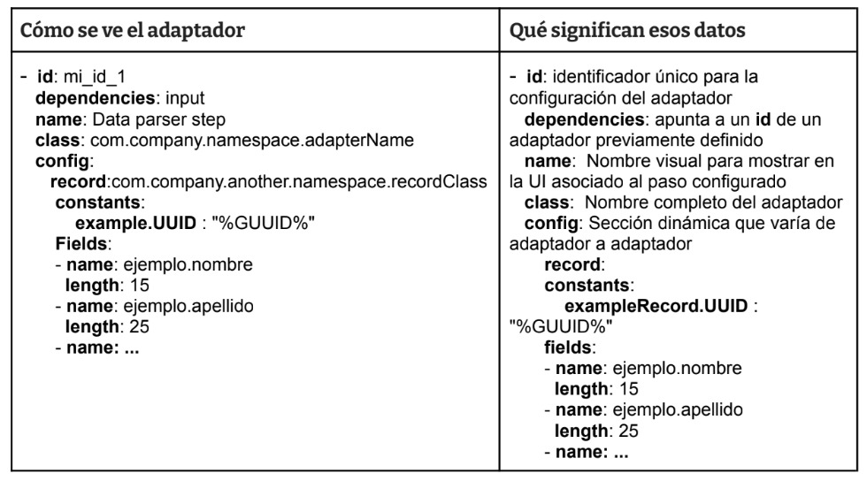

# Desafío Interfaz de adaptadores

## Índice

* [1. Preámbulo](#1-preámbulo)
* [2. Descripción general](#2-descripción-general)
* [3. Perfil de usuario](#3-perfil-de-usuario)
* [4. Historia de usuario](#4-historia-de-usuario)
* [5. Prototipo y diseño](#5-prototipo-y-diseño)
* [6. Interfaz](#6-interfaz)
* [7. Modo de usuario](#7-modo-de-usuario)
* [8. Tecnologías](#8-tecnologías)
* [9. Enlace web](#9-enlace-web)

***

## 1. Preámbulo

## Antecedentes

Equifax es una agencia multinacional que genera reportabilidad financiera de las personas y organizaciones. Es una compañía global de datos, analytics y tecnología que transforma conocimientos en información, para impulsar a clientes en la toma de mejores decisiones financieras, los cuales acuden a Equifax solicitando análisis financiero de sus respectivos clientes (ej. Un banco puede solicitar información de las personas que tienen servicios allí).

Hoy existe una gran cantidad de requerimientos de las empresas sobre sus clientes, por lo que es necesario la existencia de una plataforma web que permita reunir los datos de los requerimientos que necesiten y que los complemente con la información disponible por Equifax, y entregue una visualización de esta información.

## 2. Descripción general

Plataforma web en donde el usuario puede crear una nueva “orquestación” que permita seleccionar de una lista predeterminada, agregar uno o más adaptadores (archivos de metadata YAML), para así satisfacer la necesidad de apilar los requerimientos pertinentes al agregar/modificar sus valores de configuración, de acuerdo a las necesidades solicitadas por el cliente. Obteniendo finalmente la previsualización de la orquestación final y la opción de obtener el archivo en formato YAML al descargarlo.

## Consideraciones

Una orquestación de procesos Batch tiene distintas etapas o pasos. Cada uno de estos pasos, ejecuta un objeto conocido como “adaptador”. Al mismo tiempo, este adaptador es una clase Java que define la lógica de transformación de datos que se desee.

Los adaptadores podrían requerir una cantidad diferente de parámetros. Estos parámetros ayudan a la configuración de transformación que se requiere y están definidos en formato YAML. Los parámetros pueden ser: Key-value, List, Map.

El proceso declarado anteriormente entrega como resultado un archivo YAML, el cual contiene parámetros y configuración definida por el usuario.

## Diagrama representando el flujo completo del cliente

## Ejemplo de la metadata YAML para un adaptador

## 3. Perfil de usuario

La plataforma está destinada a desarrolladores de software o soporte TI de la empresa Equifax. Para optimizar el trabajo en reunir los datos de los requerimientos que necesiten y que los complemente con la información disponible por Equifax, y entregue una visualización de esta información, se toma en cuenta en el análisis del perfil varias características en la interacción del mismo con la plataforma, en donde se resalta, que la implementación del proceso de selección, modificación, eliminar, añadir o guardar la configuración de los adaptadores debe darse de forma simple e inmediata en una misma interfaz, para la obtención de la orquestación requerida; cumpliendo con el principal objetivo que es satisfacer las solicitudes de análisis financiero de sus respectivos clientes. 

El diseño debe estar basado en el estilo y paleta de colores de la plataforma oficial, ya que está será una extensión de la página. También se debe tomar en cuenta que el usuario final pasa una cantidad considerable de tiempo frente al ordenador por lo que la interfaz debe ser amena y de fácil entendimiento a la vista, y que posee conocimiento sobre la información y formatos de archivos que se manejan, por lo que se emplearan manejos de términos acorde al ámbito.

## 4. Historia de usuario

#### [Historia de usuario 1] Miembro de soporte TI.

Yo como miembro de soporte TI quiero seleccionar adaptadores de una forma sencilla, para visualizar y modificar los que necesito de forma rápida.

### Criterios de aceptación

* El usuario podrá acceder a las opciones de plugins a través de un dropdown o search.
* Al Clickear o seleccionar el plugin se añadirá a una lista por orden de selección.
* El usuario al clickear el plugin seleccionado en la lista, se desplegará una sección de los datos con sus respectivos campos para añadir o modificar la información.
* El usuario podrá guardar las modificaciones hechas en la configuración de cada plugin.
* El usuario tendrá la opción de cancelar cualquier modificación de datos del plugin.
* Al guardar los cambios, el usuario podrá visualizar un _check_, el cual indica que el plugin ha sido guardado.
* Se notificará al usuario que sus modificaciones han sido guardadas exitosamente con un mensaje emergente.
* Los plugins que han sido modificados pero no guardados se distinguirá por un _dot__ para su identificación.
* El usuario podrá eliminar de la lista cualquier plugin, si así lo desea, en donde al clickear el botón de eliminar, emergerá un mensaje de confirmación de dicha acción, a la cual podrá reafirmar o cancelar.

### Definición de terminado

* Transformar _data de adapters_ (YAML) a JSON.
* Diseño de 3 secciones.
* En la primera sección se ubica un dropdown/search, con el despliegue de las opciones de plugins, también al escribir deben aparecer las que coinciden con la busqueda.
* En la segunda sección se ubica la lista de plugins dinámicamente ordenados de acuerdo a su selección.
* Los plugins seleccionados se identidicarán si están guardados o no, por un _check_ y un _dot_, respectivamente.
* En la tercera sección se ubica la información requerida de cada plugin con los campos para su modificación.
* Todos los campos son modificables excepto el _mainClass_.
* Las dependencias deben ser determinadas a través de un select, cuyas opciones sean los plugin que fueron seleccioandos en la lista, con una opción por default denominada _input_.
* Los campos deben ser validados de acuerdo al tipo de dato que se espera.
* Botón para eliminar que desplegará un modal con mensaje de confirmación para eliminar el plugin con botones de eliminar o cancelar.
* Botón de guardar modificaciones que al cumplir con validaciones de campo, se despliegue modal con mensaje de guardado exitosamente.

#### [Historia de usuario 2] Desarrollador de software.

Yo como desarrollador de software quiero crear un archivo con los pluggings y poder visualizarlos para descargar el archivo como lo necesito.

### Criterios de aceptación

* El usuario podrá crear un archivo ("_orquestación_"), con los plugins seleccionados/modificados.
* Se confirmará que se hayan guardados todas la modificaciones para crear el archivo.
* Si algunas modificaciones no han sido guardadas, se desplegará un mensaje indicandole al usuario que hay plugins sin guardar.
* Al crearse el archivo, lo podrá previsualizar.
* Opcion a descargar archivo en formato YAML.

### Definición de terminado

* Obtener datos de campos por cada plugin.
* Ordenar por dependencias, partiendo de input.
* Transformar a formato YAML.
* Previsualización de orquestación.
* Botón para descargar archivo en formato YAML.

## 5. Prototipo y diseño

El diseño se baso en un estilo minimalista, limpio y profesional utilizando la paleta de colores que identifica y caracteriza a Equifax. El patrón de diseño tiene un flujo coherente y minimalista que sigue la consecución de los resultados de las ejecuciones de cada acción que se toma en la plataforma de izquierda a derecha. Comenzando por el menu dropdown, luego la lista de plugins seleccionados y finalmente el despliegue de la información con sus respectivos datos para su configuración, siendo este el proceso de desplazamiento e interacción del usuario por la plataforma. La interfaz es diseñada para dispositivos de tipo desktop.

En base a la interfaz de Equifax, se jugo con la paleta de colores original, en donde predomina los matices de grises y negros; principalmente el gris oscuro plomo de fondo, simulando el _dark_ _mode_, en donde tiene mayor protagonismo al resaltar los elementos de interes; esto también ayuda a evitar o aminorar el cansancio visual,considerando las altas horas que tanto los desarrolladores de software o soporte de TI pasan en el ordenador.

El color burdeo que resalta en el _header_ el logo de Equifax, característico de la página oficial de la empresa. El blanco se denota en el texto de toda la página en contraste con el fondo, de fácil lectura. Y por último los botones azules también característico de la página oficial.

### Prototipo de baja fidelidad.

### Prototipo de alta fidelidad.

## 6. Interfaz

## 7. Modo de usuario

- Al ingresar a la plataforma, a través del menú dropdown que a su vez posee un search box, podrá seleccionar o hacer la busqueda específica de las diferentes opciones de plugins.
- Al elegir los plugins, apareceran de manera simultánea en una lista por orden de selección. Al clickear cada plugin seleccionado en la lista, siguiendo la dinámica de un tab, aparecerá la información correspondiente de cada plugin, en donde se podrá ingresar los datos; estos podrán ser guardados al clickear el botón _Save_, en donde de forma inmediata en la lista se indicará el plugin que fue guardado por un _check_ y a su véz emergera un mensaje que le notificará al usuario que fue exitosamente guardado. 
- También se podrá eliminar los plugin, a través de un botón, que al clickearlo se desplegará un mensaje de confirmación para eliminar, en donde podrá confirmar la eliminación o cancelarla. 
- Una vez ingresado todos los datos correspondientes, se podrá crear la orquestación con todos los plugins seleccionados.
-  Si alguno de los plugins no fue guardado, al intentar crear la orquestación se desplegara un mensaje advirtiendole que quedan plugins por guardar, los cuales serán aquellos en la lista que tengan un _dot_. 
- Una vez guardados todos los plugins se crea y visualiza la orquestación con opción a descargar en formato YAML. 

## 8. Tecnologías

* React.js.
* Javascript ES6.
* Bootstrap 5.

## 9. Enlace web